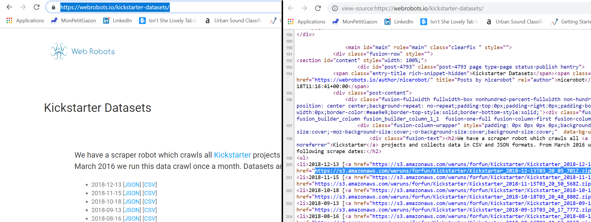
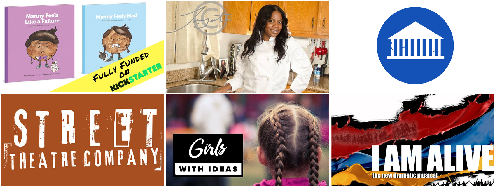
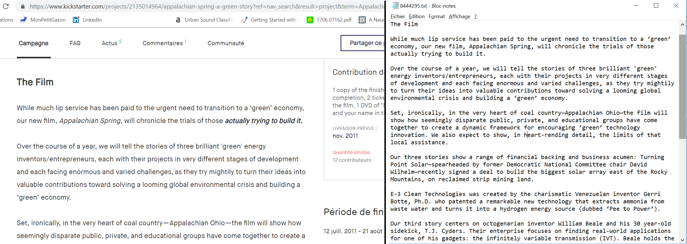

# Data Downloader

We are using data scrapped from the website 'www.kickstarter.com', made available by  webrobots (https://webrobots.io/kickstarter-datasets/) and 
hosted on a AWS S3 instance. 



Hence, we're using *boto3* packages on Python so as to download it manually and store it directly on a local machine without having to store it on a cloud.
Once the data is downloaded, we unzip the dataframe and concatenante all the cvs at our disposal into one.

One can use the following command line to run the downloaded 

```python
from kickstarter_datadownloaded import start_downloading
strat_downloading() 
```
This gives us access to 50 datasets with approximately 4 000 projects in each. This data is pretty intersting as it gathers a lot of differents information not availalable in similar Kaggle Dataset. Indeed, we have access to lots of differents url links toward the project home page on Kickstarter for instance, or url toward the images. The idea was then to use python scapping packages to get the description of all project (to enable possible Natural Language Processing analysis for instance) as well as images (so as to do image analysis/image classification?) :

### Images : 

```python
df = pd.read_csv(...)
from kickstarter_datadownloaded import image_scrapper
download_from_pandas(df) 
```

By default, it creates a repository ./data/Image where it will store images with unique project ID



### Descriptions :

```python
df = pd.read_csv(...)
from kickstarter_datadownloaded import description_scrapper
download_from_pandas(df) 
```
Similarly, we use the *newspaper* python package in order to scrap the text from the project home page on kiskstarter.com



### Features

Once we merged all the dataframes, we select, clean a bit and process variables we'll consider for the task in the *dataframe_and_feature_processing* python file. More specifically, we will use data relative to : 

- **the project itself** : name, short_description, main_category, category
- **important dates** : created_at, launched_at, state_changed_at, deadline
- **the place and the currency** : country, city, state_location, static_usd_rate, currency
- **the creator** : creator_id, creator_name
- **objectif and Pledge funds** : goal, pledged, achieved (%), usd_pledged
- **special treatment** : project_we_love (tag from KickStater's preferenced project)
- **additional data** : image_available, description_available
 

